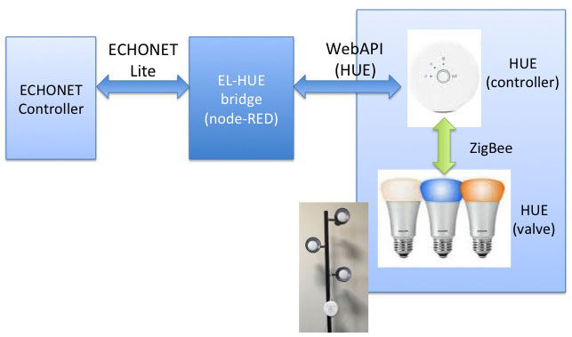

# ECHONET Lite Converter for Phillips Hue by Node-RED

2018.07.10 Rev. 1.0.0

## Abstract
　Phillips社のHueはON/OFF, 輝度, 色などをWebAPI(REST)で制御できるLED照明である。Node-REDを利用してHUEをECHONET Lite対応した。HUEのスターターキットには電球が３個含まれるので、ECHONET Liteとしては１つのNode Profileと３つの一般照明オブジェクトで構成されるモデルとし、それぞれのECHONET Object(EOJ)を 0x029001, 0x029002, 0x029003 と表現する。一般照明のECHONET Property Code(EPC)としては、0x80（動作状態）, 0xB0（照度レベル）, 0xB6（点灯モード設定）, 0xC0（RGB設定）を実装した。  

Phillips Hue is a LED lighting whose functions such as on/off, brightness and color can be controlled through WebAPI(REST). As a starter kit of the Hue contains three valves, I applied a model of three device objects under one node profile of ECHONET Lite. EOJ of each valve is assigned as 0x029001, 0x029002 and 0x029003. Follwing EPCs of 0x80(Operating status), 0xB0(Brightness), 0xB6(Operation mode) and 0xC0(Color setting) are implemented.

## Preparation
#### Japanese
- HueはiPhoneまたはAndroid Phoneの専用アプリを利用して動作確認すること
- [HUE Developer Program](https://www.developers.meethue.com)のGetting Startedを参照してHUE Bridgeのusernameを取得すること
- Node-redは[ここ](https://nodered.org/)を参照してインストールすること

#### English
- Confirm Hue is properry configured using Hue Apps on iPhone or Android phone.
- Refer Getting Started of [HUE Developer Program](https://www.developers.meethue.com) and get username of HUE Bridgeのusername
- Install Node-RED refering [here](https://nodered.org/)

## System Configuration
　今回Node-REDを利用して開発したECHONET LiteとHue WebAPIのConverterをEL-HUE Converterと呼ぶ。ECHONET LiteのコントローラはEL-HUE ConverterとECHONET Liteで通信する。EL-HUE ConverterとHUE BridgeはHUEのWebAPI(REST)で通信する。HUE BridgeとHUEはZigBeeで通信する。  

A converter we developed between ECHONET Lite and Hue WebAPI is called as "EL-HUE Converter". ECHONET Controller communicates EL-HUE Converter with ECHONET Lite protocol. EL-HUE Converter communicates HUE Bridge with HUE WebAPI(REST). HUE Bridge communicates valves with ZigBee.

  

## Implementation of ECHONET Lite
#### Node Profile  

| EPC  | Description              | Implementation | Initial value |
|------|---------------------------|----------------|---------------|
| 0x80 | 動作状態                   | GET 0x30(ON) | 0x30 |
| 0x82 | Version情報               | GET V1.12 | 0x010C0100 |
| 0x83 | 識別番号                   | GET | 0xFE000077000102030405060708090A0B0C |
| 0x8A | メーカーコード              | GET KAIT | 0x000077 |
| 0x9D | 状変アナウンスプロパティマップ | GET  | 0x0280D5 |
| 0x9E | Setプロパティマップ         | GET  | 0x00 |
| 0x9F | Getプロパティマップ         | GET  | 0x0C8082838A9D9E9FD3D4D5D6D7 |
| 0xD3 | 自ノードインスタンス数       | GET  | 0x03 |
| 0xD4 | 自ノードクラス数            | GET  | 0x02 |
| 0xD5 | インスタンスリスト通知       | INF  | 0x03029001029002029003 |
| 0xD6 | 自ノードインスタンスリストS   | GET  | 0x03029001029002029003 |
| 0xD7 | 自ノードクラスリストS        | GET  | 0x010290 |

#### Device Object  

| EPC  | Description              | Implementation | Initial value |
|------|---------------------------|----------------|---------------|
| 0x80 | 動作状態                   | SET/GET/INF 0x30(ON), 0x31(OFF) | 0x30 |
| 0x81 | 設置場所                   | GET Living | 0x08 |
| 0x82 | 規格Version情報            | GET Release I| 0x00004900 |
| 0x88 | 異常発生状態                | GET 異常なし| 0x42 |
| 0x8A | メーカーコード              | GET KAIT | 0x000077 |
| 0x9D | 状変アナウンスプロパティマップ | GET  | 0x03808188 |
| 0x9E | Setプロパティマップ         | GET  | 0x0480B0B6C0 |
| 0x9F | Getプロパティマップ         | GET  | 0x0B808182888A9D9E9FB0B6C0 |
| 0xB0 | 照度レベル設定値            | SET/GET 0...64 | 0x64 |
| 0xB6 | 点灯モード設定              | SET/GET  0x42(通常灯), 0x43(常夜灯), 0x45(カラー灯)| 0x42 |
| 0xC0 | カラー灯モード時RGB設定      | SET/GET 3Bytes RGB | 0xFFFFFF |

## Installation
#### Japanese
1. PCのネットワークスキャンアプリを利用してローカルネットワークのスキャンを行い、manufactureがPhillipsとなっている機器(HUE Bridge)のIPアドレスを取得する
2. Node-REDを起動する
3. Flow file "flow_HueEL.txt"をテキストエディタで開き、全てを選択してコピーする。Node-REDのメニューから"読み込み/クリップボード"を選択しペーストし、読み込みボタンをクリック。
4. setupHueBridge node内のipHueBridgeとuserNameHueBridgeの値を修正する  
5. デプロイボタンをクリックする
6. Flow内のinject node "ON", "OFF" をクリックし、HUEが点灯／消灯するかを確認する。正常に動作しない場合は、ネットワークの接続やipHueBridgeとuserNameHueBridgeの値を確認する

#### English
1. Using network scan application on PC, scan local network and identify a device whose manufacture name is Phillips and get HUE Bridge IP address.
2. Launch Node-RED
3. Open a flow file "flow_HueEL.txt" with a text editor, select all and copy. Select Import/Clipboard of Node-RED menu, paste and click import button.
4. Open setupHueBridge node and modify the values of ipHueBridge and userNameHueBridge
5. Click Deploy button
6. Click inject node "ON" and "OFF" in the flow and confirm the valve will turn on and off. If it doesn't work, check network connection and values of ipHueBridge and userNameHueBridge

## How to increase a Valve
現在のプログラムは３個の電球に対応している。電球を１個追加する方法を以下に示す。  
Current flow supports three valves. Here is an instruction to add another valve.

1. Connect a valve with the HUE bridge and check it with an app on a smart phone
2. Open "Initialization" node on Node-RED and add the following element {...}

```
global.set("epc_device", [
{
    0x80: [0x30],
    0x81: [0x08],
    0x82: [0x00, 0x00, 0x49, 0x00],
    0x88: [0x42],
    0x8A: [0x00, 0x00, 0x77],
    0x9D: [0x03, 0x80, 0x81, 0x88],
    0x9E: [0x04, 0x80, 0xB0, 0xB6, 0xC0],
    0x9F: [0x0B, 0x80, 0x81, 0x82, 0x88, 0x8A, 0x9D, 0x9E, 0x9F, 0xB0, 0xB6, 0xC0],
    0xB0: [0x64],
    0xB6: [0x42],
    0xC0: [0x00, 0xFF, 0xFF]
},
```
<ol start="3">
	<li>Open "rest" node and modify the following code</li>
</ol>
>     for (let id = 1; id < 4; id++) {

to

>     for (let id = 1; id < 5; id++) {
