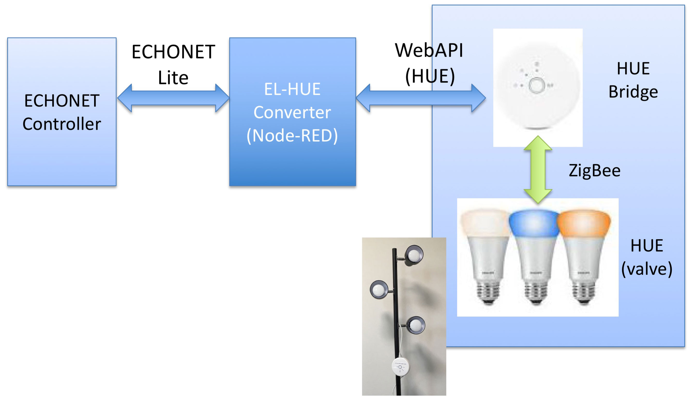

#Node-REDを使ってPhillips HUEをECHONET Lite対応する

2017.08.02 Rev. 1.0.0

### 概要
　Phillips社のHUEはON/OFF, 輝度, 色などをRESTで制御できるLED照明である。Node-REDを利用してHUEをECHONET Lite対応した。HUEのスターターキットには電球が３個含まれるので、ECHONET Liteとしては１つのNode Profileと３つの一般照明オブジェクトで構成されるモデルとし、それぞれのECHONET Object(EOJ)を 0x029001, 0x029002, 0x029003 と表現する。一般照明のECHONET Property Code(EPC)としては、0x80（動作状態）, 0xB0（照度レベル）, 0xB6（点灯モード設定）, 0xC0（RGB設定）を実装した。 

### 準備
- HUEはiPhoneまたはAndroid Phoneの専用アプリを利用して動作確認すること
- Node-redはインストール済みとして話を始める
- [HUE Developer Program](https://www.developers.meethue.com)のGetting Startedを参照してHUEコントローラのuserを作成すること（user作成時にユーザー名指定することは以前は可能であったが、現在はできない）。

### システム構成
　ECHONET LiteのコントローラはECHONET-HUEブリッジとECHONET Liteで通信する。ECHONET-HUEブリッジととHUEコントローラはHUEのRESTで通信する。HUEコントローラとHUEはZigBeeで通信する。

  

### EPC
EPCの実装を示す  
Node Profile  
  

機器Object  
  

### Installation
Installationは以下の通り  

1. HUEコントローラのIPアドレスを調べる  
スマホアプリのFingなどを利用してローカルネットワークのスキャンを行い、HUEコントローラのIPアドレスを調べる。

2. Node-REDを起動する
3. Node-REDのFlowをimportする  
Flow fileのHueEL3B.txtをテキストエディタで開く。全てを選択してコピーする。Node-REDのメニューからimport/clipboardを選択しペーストする。Importボタンをクリック。

4. http request node内のIP addressとuser nameを修正する  
http request nodeを開く。URLのIP Addressとuser nameをLANに接続されているHUEコントローラのIP Addressとuser nameに修正する。

5. Flowを実行する  
Deployボタンをクリックする

6. HUEのRESTの動作確認をする  
Flow内のON/OFFスイッチでHUEが点灯／消灯するかどうかを確認する。正常に動作しない場合は、ネットワークの接続・HUEコントローラのIP Addressやusernameを確認する

7. SSNG for iPhoneなどのツールでECHONET Liteコマンドを使ったHUEの動作を確認する  
SSNG for iPhoneは任意のECHONET Lite packetを生成・送信できるiPhone用のアプリである。App Storeからダウンロードできる。iPhoneの設定で「モバイルデータ通信」をOFF、WiFiで目的のネットワークに接続した後SSNG for iPhoneを起動する。Searchを行い、発見されたIP Addressを順次選択して「神奈川工科大学」「一般照明」と表示されるものを探す。EOJで029001, 029002, 029003のどれかを選択する。ESV, EPC, EDTを選択してSendをTapして動作を確認する。
